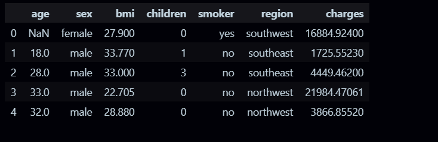
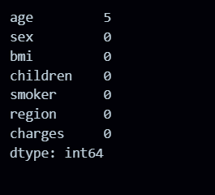
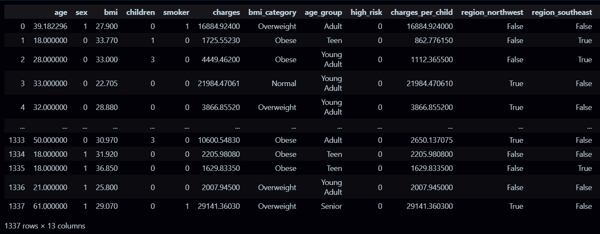
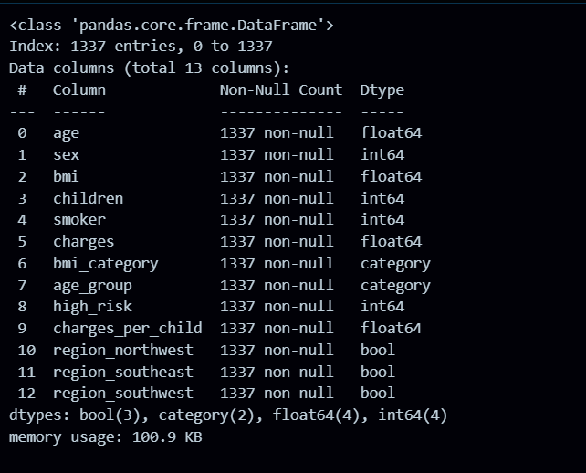

# VAUTECH IT SOLUTIONS – TASK 3

**Intern:** Ansh Verma

**Intern ID:** VT26DS001

**Domain:** Data Science

**Company:** VAUTECH IT SOLUTIONS

**Mentor:** Vishal Rajbhar

## Overview

This task focuses on cleaning the Instagram Usage Lifestyle dataset and improving its quality by handling missing and incorrect values, removing duplicates and irrelevant columns, and creating new derived features.

The goal is to prepare a clean, structured, and reliable dataset that can be used for accurate analysis and further machine learning modeling.

## Objectives

- Clean the dataset by handling missing and incorrect values
- Remove duplicate records
- Remove irrelevant columns
- Standardize categorical values
- Create derived features for better analysis
- Prepare the dataset for Exploratory Data Analysis (EDA) and Machine Learning

## Tools Used

- Python
- Pandas
- Numpy
- Jupyter Notebook / VS Code

## Workflow

- Dataset: insurance
- format: CSV
- Source:https://github.com/MainakRepositor/Datasets/blob/master/insurance.csv

## Step 1: Loading the Dataset

- import pandas as pd df = pd.read_csv('insurance.csv')
  

## Step 2: Check missing values

## Step 3: Region_northwest

## Step 4: Final Check

## Conclusion

This task involved cleaning and enhancing the Instagram Usage Lifestyle dataset by handling missing values, removing duplicates, correcting inconsistencies, and eliminating irrelevant columns.

New derived features such as age group, screen time category, lifestyle score, and low sleep flag were created to improve analytical insights.

The final dataset is now clean, well-structured, and ready for advanced data analysis and machine learning modeling.
